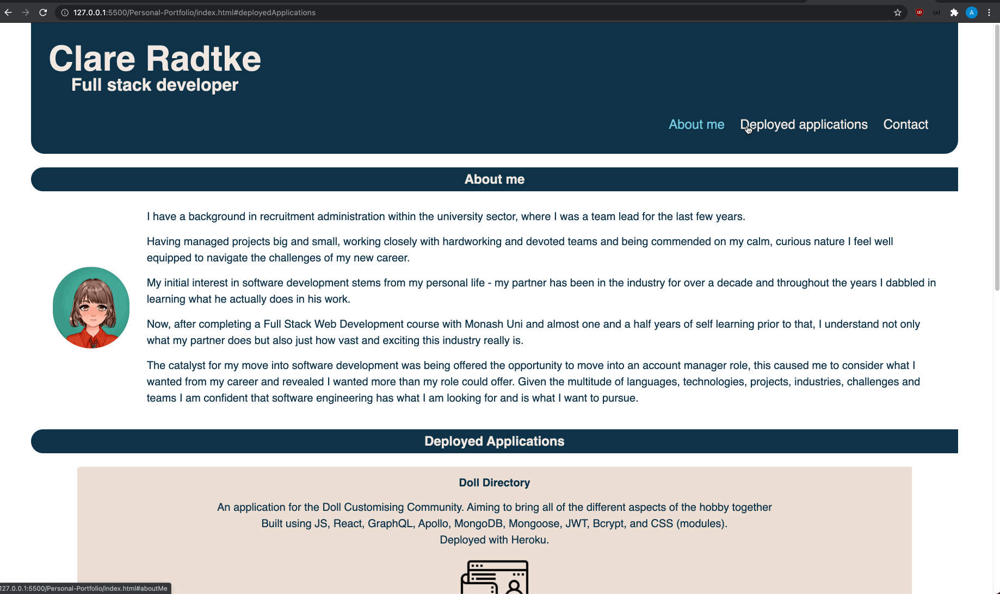

# Personal-Portfolio

A site to show my skills and deployed applications

[My Personal Portfolio](https://clareradtke.github.io/Personal-Portfolio/)

A portfolio to showcase my skills, try out designs and direct potential employers to.
Essentially an online resume!

## Icon Attributions:

Icons from [freeicons.io](https://freeicons.io):

- Food icon by [charlie](https://freeicons.io/profile/740)
- Network icon by [icon king1](https://freeicons.io/profile/3)

Icons from [flaticon.com]("https://www.flaticon.com/"):

- Money chart and Blog icons by [Freepik](https://www.freepik.com)
- Directory icon by [Eucalyp](https://www.flaticon.com/authors/eucalyp)

## Requirements for this application:

- [x] Responsive layout - begin Mobile first & work up

Header:

- [x] title
- [x] Nav bar - links to sections on page

Main:

- [x] About me section w/ photo - achieved
- [x] Work section:
  - [x] shows applications created (with placeholders)
  - [x] first one should have larger image than the rest
  - [x] when clicked the deployed app is loaded in new tab

Footer:

- [x] Contact info

